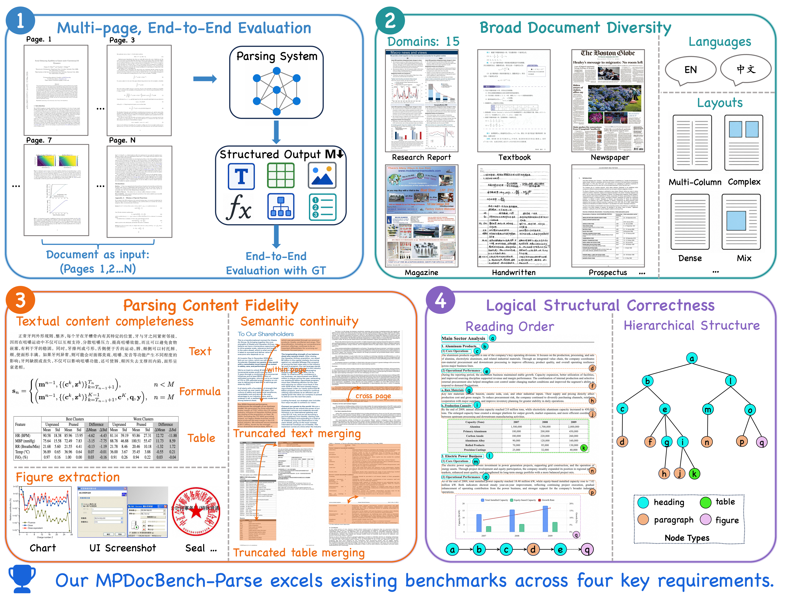

[English](./README.md) | 简体中文

# MPDocBench-Parse

多页文档解析的实用评测基准

[](https://arxiv.org/abs/2605.03903) [](https://github.com/Tongyi-Zhiwen/Qwen-Doc) [](https://www.modelscope.cn/datasets/zhoubb/MPDocBench) [](https://bang123-box.github.io/MPDocBench-Parsing-Leaderboard/) [](LICENSE)

**MPDocBench-Parse** 是面向 **多页文档解析实战场景** 打造的综合评测基准与工具包。区别于以往的单页评测，它在 **覆盖中英双语、横跨 15 个领域的 420 篇真实 PDF 文档（包含 3135 张图像）** 上对解析系统进行 **端到端的整篇文档评测**。除了传统的元素级保真度（文本、公式、表格），MPDocBench-Parse 独特地考察另外几个在实际部署中至关重要、却长期被忽视的能力：**语义连续性**——跨页或跨版面截断的文本与表格能否被正确拼接还原；**图像抽取**——文档中的图像信息能否被准确地抽取出来；以及 **文档级逻辑结构**——阅读顺序与标题层级。上述维度共同构成了一套完备且统一的评测体系，为通用 VLM 与专业解析模型提供一份全面的衡量标尺。

> **关于开源数据集的说明。** 如原始论文所述，该基准共包含 **433 篇文档**。经合规审查后，**13 篇** 涉及版权、安全或政治敏感问题的文档已被移除。因此，公开发布版本的数据集包含 **420 篇 PDF 文档**。

<p align="center">
  
</p>

---

## 特点

**1. 多页端到端评测**
以完整多页文档（第 1、2 … N 页）作为输入，对照标注数据对解析结果进行端到端评测，一次覆盖所有内容类型。

**2. 广泛的文档多样性**
涵盖 15 个领域，文档包含中英双语，版式丰富。

**3. 内容解析保真度**
评测四类元素的提取完整性与准确性：
- **文本** — 归一化编辑距离（Edit_dist）、BLEU、METEOR
- **公式** — 字符检测匹配（CDM）
- **表格** — 基于树编辑距离的相似度（TEDS）
- **图片** — 图片检测 F1（FigureF1）

同时通过 Relation F1 评测跨页截断元素的**语义连续性**（截断文本合并、截断表格合并）。

**4. 逻辑结构正确性**
评测解析输出的逻辑组织：
- **阅读顺序** — 内容块序列的编辑距离
- **层级结构** — 文档标题层级的 HeadTEDS

---

## 安装

### 环境要求

- Python 3.10+
- Node.js、ImageMagick、LaTeX *（可选 — 仅 CDM 公式评测需要）*

### 安装步骤

```bash
conda create -n mpdocbench python=3.10 -y
conda activate mpdocbench
pip install -r requirements.txt
```

### CDM 环境 *（可选）*

如需使用 CDM 进行公式评测，请参阅 [CDM 安装指南](./metrics/cdm/README.md) 了解额外依赖（Node.js、ImageMagick、TeX Live）。

---

## 数据下载

### 1. 下载 MPDocBench 数据集

通过以下链接下载数据集，解压至 `MPDocBench/` 目录：

```bash
wget https://www.modelscope.cn/datasets/zhoubb/MPDocBench/file/view/master/MPDocBench_data.zip -O MPDocBench_data.zip
unzip MPDocBench_data.zip -d ./
rm MPDocBench_data.zip
```

### 2. 下载 SlideVQA 文档

部分评测依赖 [SlideVQA](https://huggingface.co/datasets/NTT-hil-insight/SlideVQA) 数据集中的文档，请使用提供的脚本获取所需子集：

```bash
python ./tools/download_data_from_slidevqa.py
```

> 该脚本会将所需的 SlideVQA 文件下载到 `MPDocBench/images` 下的相应位置。

---

## 快速开始

### 1. 准备数据

| 类型 | 说明 |
|---|---|
| 标注数据 (Ground Truth) | 包含标注文档结构的 JSON 文件（默认 `MPDocBench.json`） |
| 预测结果 (Prediction) | 包含模型输出 markdown 文件的目录（每个 PDF 对应一个 `.md` 文件） |

可参考 [`tools/model_infer/`](tools/model_infer/) 下的推理脚本，使用各种模型（如 Chandra、Dolphin、GLM-OCR、MinerU、MonkeyOCR-Pro、PP-OCR-VL、Qwen-VL 等）运行推理。获取原始模型输出后，运行 [`tools/model_infer/prediction_to_md/`](tools/model_infer/prediction_to_md/) 下对应的 notebook，将预测结果转换为评测器所需的 markdown 格式。

### 2. 运行评测

```bash
python pdf_validation.py --config ./configs/end2end.yaml
```

结果将保存至 `result/` 目录。

### 支持的指标

| 指标 | 任务 | 说明 |
|:---|:---|:---|
| Edit_dist | 文本 / 阅读顺序 / 截断文本合并 | 归一化编辑距离 |
| BLEU | 文本 | 双语评测替补 |
| METEOR | 文本 | 显式排序的翻译评测指标 |
| TEDS | 表格 / 截断表格合并 | 基于树编辑距离的相似度 |
| CDM | 公式 | 字符检测匹配 |
| Relation_F1 | 表格/文本关系 | 截断合并关系的 F1 分数 |
| HeadTEDS | 标题 | 标题结构的树编辑距离 |
| FigureF1 | 图片 | 图片检测的 F1 分数 |

---

## 评测结果

> 支持排序和筛选的交互式排行榜详见 [leaderboard](https://bang123-box.github.io/MPDocBench-Parsing-Leaderboard/)。

在 **MPDocBench-Parse** 上评测的模型，包括通用 VLM 和专业 OCR/解析模型，覆盖所有支持的指标。

| 模型 | Overall | Text Edit | Truncated Text Edit | Formula CDM | Table TEDS | Truncated Table TEDS | Figure F1 | Read Order | Heading TEDS |
|:---|:---:|:---:|:---:|:---:|:---:|:---:|:---:|:---:|:---:|
| **流水线式专业 VLM** | | | | | | | | | |
| GLM-OCR | 75.01 | 0.062 | 0.313 | 87.62 | 82.69 | 63.15 | 71.63 | 0.126 | 44.95 |
| PaddleOCR-VL-1.5 | **80.70** | 0.048 | **0.152** | 87.14 | 83.87 | 83.09 | **74.99** | 0.106 | 47.11 |
| MinerU2.5 | 77.30 | 0.060 | 0.326 | 85.42 | 86.18 | 88.02 | 72.32 | 0.120 | 37.01 |
| MinerU2.5 pro | 79.77 | 0.077 | 0.191 | 88.00 | **89.23** | **91.44** | 72.77 | 0.125 | 36.10 |
| Youtu-Parsing | 74.34 | 0.091 | 0.343 | 86.87 | 85.14 | 63.95 | 71.62 | 0.130 | 43.55 |
| MonkeyOCR-pro-3B | 74.41 | 0.055 | 0.302 | 88.53 | 78.76 | 61.22 | 73.69 | 0.119 | 40.65 |
| Dolphin-v2 | 73.07 | 0.106 | 0.333 | 79.58 | 84.16 | 64.31 | 63.98 | 0.138 | 50.23 |
| **端到端专业 VLM** | | | | | | | | | |
| dots.mocr | 72.94 | 0.070 | 0.300 | 86.03 | 81.94 | 62.21 | 67.85 | 0.113 | 33.70 |
| FireRed-OCR | 69.29 | **0.042** | 0.179 | **89.68** | 81.88 | 62.63 | 0.00 | 0.087 | **50.84** |
| dots.ocr | 74.19 | 0.074 | 0.305 | 85.88 | 83.46 | 60.71 | 67.59 | 0.114 | 45.21 |
| DeepSeek-OCR2 | 76.43 | 0.068 | 0.256 | 86.62 | 81.25 | 63.02 | 73.46 | 0.104 | 49.93 |
| OCRVerse | 64.47 | 0.104 | 0.293 | 86.89 | 84.14 | 63.99 | 0.00 | 0.152 | 35.63 |
| Logics-Parsing-v2 | 74.57 | 0.047 | 0.313 | 86.67 | 83.95 | 63.88 | 71.71 | **0.085** | 34.72 |
| Qianfan-OCR | 71.89 | 0.095 | 0.467 | 88.74 | 83.18 | 62.46 | 58.44 | 0.110 | 49.48 |
| ChandraOCR 2 | 74.62 | 0.097 | 0.294 | 86.67 | 84.74 | 64.70 | 64.66 | 0.134 | 48.69 |
| **通用 VLM** | | | | | | | | | |
| Gemini-3.1-pro-preview | 71.94 | 0.070 | 0.223 | 88.37 | 81.99 | 61.30 | 58.93 | 0.127 | 26.90 |
| ChatGPT-5.2-2025-12-11 | 65.47 | 0.111 | 0.387 | 84.33 | 79.31 | 58.85 | 30.90 | 0.170 | 37.23 |
| Qwen3.6-plus | 71.95 | 0.095 | 0.260 | 88.77 | 83.33 | 60.53 | 64.77 | 0.182 | 31.94 |
| Qwen3-VL-235B | 74.00 | 0.088 | 0.187 | 84.71 | 81.64 | 61.28 | 63.20 | 0.138 | 42.41 |
| InternVL-3.5-38B | 57.18 | 0.131 | 0.502 | 84.30 | 69.93 | 51.63 | 8.02 | 0.198 | 26.78 |

---

## 许可证

本项目基于 **Apache License 2.0** 许可，详见 [LICENSE](LICENSE) 文件。

## 版权声明

本基准中包含的 PDF 文档来源于公开可访问的互联网资源以及开源社区的自愿贡献。任何不允许再分发的材料在发布前已被仔细过滤。本数据集**仅供学术和研究用途**，不得用于任何商业活动。

如认为本基准中的任何内容涉及版权问题，请及时与我们联系，我们将迅速处理。

---

## 致谢

- [OmniDocBench](https://github.com/opendatalab/OmniDocBench) 
- [CDM](https://github.com/opendatalab/UniMERNet/tree/main/cdm) 
- [READoc](https://github.com/icip-cas/READoc) 

---

## 引用

如果您在研究中使用了 MPDocBench-Parse，请引用我们的论文：

```bibtex
@misc{zhou2026mpdocbenchparsebenchmarkingpracticalmultipage,
      title={MPDocBench-Parse: Benchmarking Practical Multi-page Document Parsing}, 
      author={Bangbang Zhou and Hangdi Xing and Yifan Chen and Jianjun Xu and Qi Zheng and Feiyu Gao and Zhibo Yang and Shuai Bai and Ming Yan and Jieping Ye and Hongtao Xie},
      year={2026},
      eprint={2605.22100},
      archivePrefix={arXiv},
      primaryClass={cs.AI},
      url={https://arxiv.org/abs/2605.22100}, 
}
```

